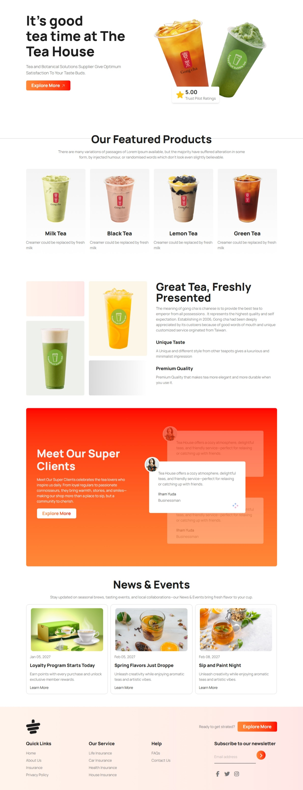

# Tea House - A Sanctuary of Flavor & Calm

Step into Whispers of Tea, where every cup tells a story steeped in tradition and tranquility. Our tea house offers a curated selection of artisanal blends—from delicate white teas to bold, spiced infusions—served in a serene setting designed to soothe the senses. Whether you're seeking a quiet moment alone or a cozy gathering with friends, we invite you to slow down, sip deeply, and savor the art of tea.

## Table of Contents

- [Run it Locally](#run-it-locally)
- [Technology Used](#technology-used)
- [Screenshots](#screenshots)
- [Necessary Links](#necessary-links)
- [Credit](#credit)

## Run it Locally

Please follow the below instructions to run this project in your machine:

1. Clone this repository

   ```sh
       git clone https://github.com/sagormajomder/tea-house.git
   ```

2. Open the directory "tea-house" into visual studio code and contribute
3. run `npm i` to install all dependencies
4. run `npm start` to build the project
5. Install`live server` extension on vscode and run to see the project in browser

The project will be available on http://127.0.0.1:5500/ by default.

## Technology Used

- Tailwindcss
- FontAwesome
- Google Fonts

## Screenshots

### Desktop



### Tablet


### Mobile


## Necessary Links

- Repository link: [Tea house repository](https://github.com/sagormajomder/tea-house)
- App live link : [Tea house live](https://sagormajomder.github.io/tea-house/)

## Credit

This project is designed by [Programming Hero](https://github.com/ProgrammingHero1)
